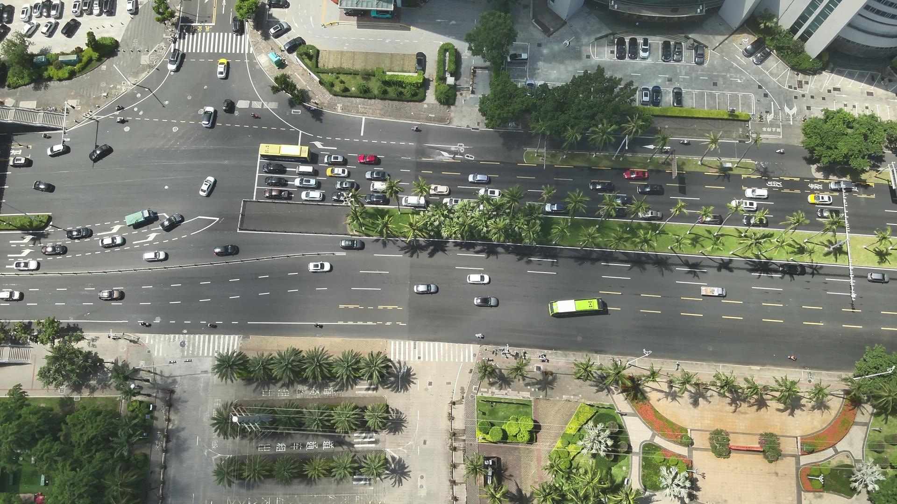
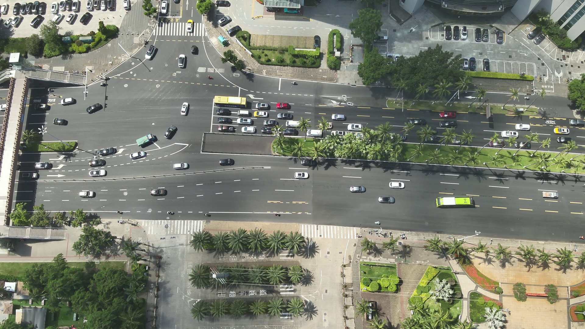
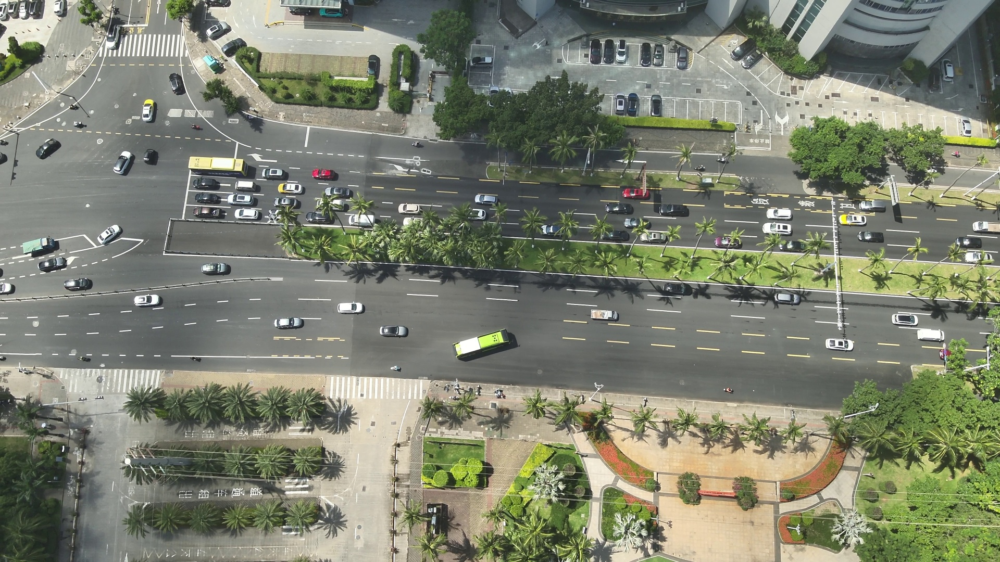
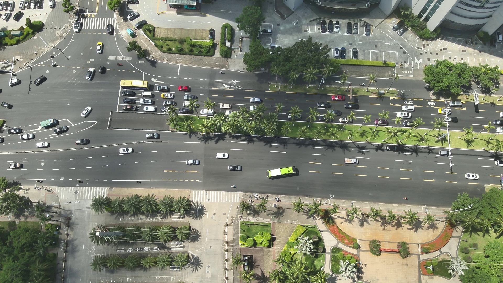

# 🚀 智能路径规划论文展示

## 摘要
本文介绍了一种基于学习策略的旅行商问题优化方法。  
通过结合多臂老虎机模型和动态学习机制，实现了在复杂网络中快速找到最优路径的能力。  

---

## 方法

传统 TSP 求解器存在局限性，我们提出一种自适应优化算法，核心流程如下：

1. **扩展候选边集**：突破传统限制，增加搜索空间  
2. **动态赋值 M-value**：根据历史经验评估边的价值  
3. **使用 ε-greedy 策略**：平衡探索与利用  
4. **实时更新策略**：根据反馈优化决策  

---

## 实验结果

实验在 TSPLIB 数据集上进行，结果如下：

### 性能指标
- 平均解质量提升：57%  
- 基准测试胜率：33/62  
- 平均误差率：0.003%  
- 问题类型覆盖：3+  

### 算法对比

- 相比传统 LKH：在大规模测试中展现压倒性优势  
- 相比 VSR-LKH：关键指标显著提升  
- 相比 NeuroLKH：多维度全面领先  

---

## 应用场景

### 智能物流网络
  
在智慧城市的物流网络中，实现实时路线优化，提高配送效率。

### 精密制造优化
  
在芯片制造过程中，控制路径精度，提升制造质量。

### 太空探索路径规划
  
规划最优航行轨道，节省燃料并保证安全。

### 自动驾驶网络
  
实现车队协作与智能路径规划，构建高效交通系统。

---

## 结论

本研究提出的算法不仅在技术上实现突破，更将优化算法的**效率与美学**结合。  
通过强化学习策略的引入，实现了高效、自适应、可扩展的路径规划方法。  

**关键词**：TSP，旅行商问题，强化学习，路径优化，多臂老虎机
