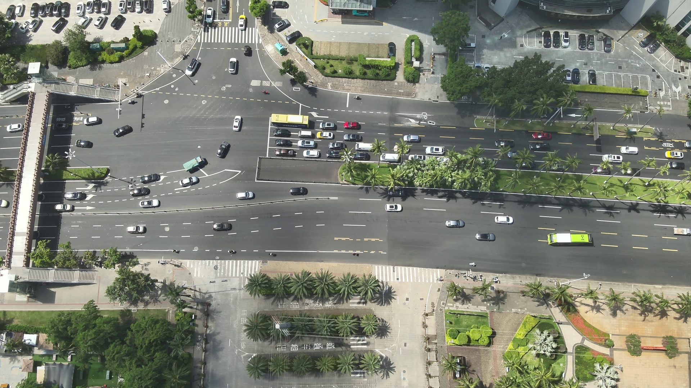

**空域特征分解用于高效航空图像目标检测**

**Ren Jin，Zikai Jia，Xingyu Yin，Yi Niu，Yuhua Qi**

👉 **[📄 Paper](https://your-paper-link-here)**  
👉 **[💻 Code](https://github.com/xxx/xxx)**  
👉 **[📊 Supplementary](https://xxx)**

---

## 摘要

无人机航空图像中的目标检测面临显著的域自适应挑战，例如拍摄高度、视角以及天气条件的变化。这些因素构成了大量细粒度域，对检测网络的泛化能力提出了更高要求。

针对上述问题，本文利用实际成像条件参数，将图像特征分解为**域不变特征**与**域相关特征**。通过特征重组，相比传统细粒度域检测方法，该方法在域泛化能力和单一域检测精度方面均取得了提升。

此外，为解决高频成像条件参数导致的过拟合问题，本文采用一种**均衡采样的数据混合策略**，将来自不同成像条件的图像作为训练输入。该数据增强方法有效提升了训练过程的鲁棒性，并缓解了高频成像参数带来的过拟合现象。

在 **UAVDT** 与 **VisDrone** 数据集上的实验结果表明，该方法相比现有先进的细粒度域检测算法，平均检测精度分别提升 **5.7** 和 **2.4**。机载实验进一步验证了该算法在搭载 **Nvidia Jetson Xavier NX** 的板载计算平台上，对 **720P** 图像可实现 **20 Hz** 的实时处理性能。

---

**关键词**：航空图像；目标检测；成像条件；特征分解

---

## 方法概述

本文提出了一种基于成像条件的域特征分解框架，用于提升航空图像目标检测的泛化能力。  
整体网络结构如下所示。

图 1：基于成像条件的域特征分解检测框架

