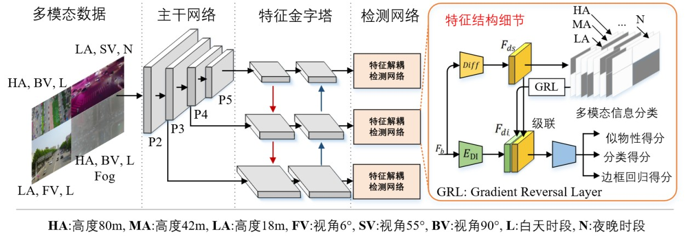
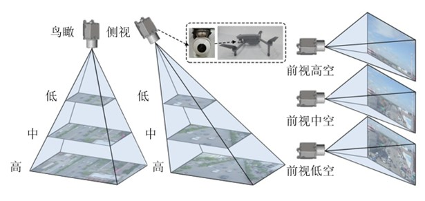
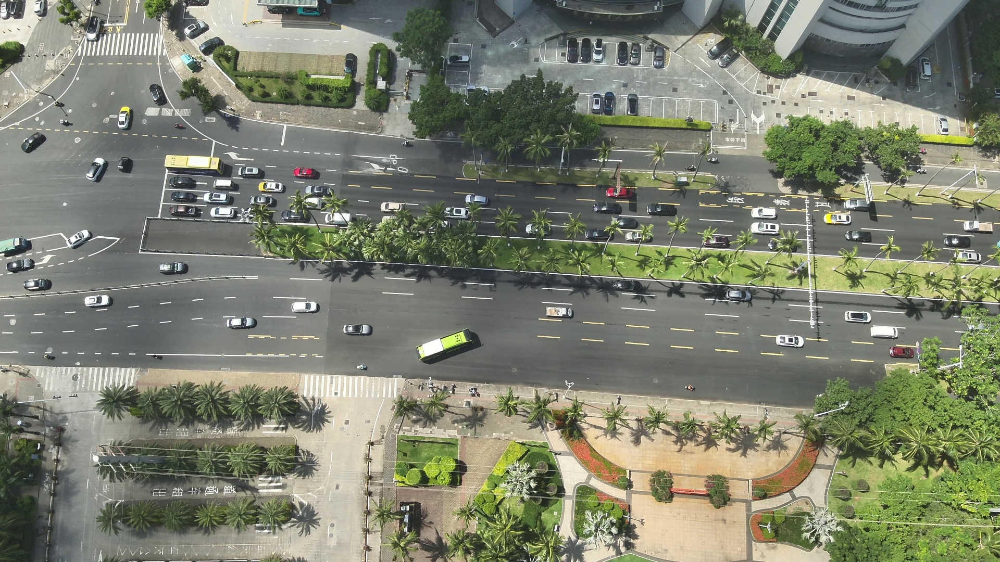

# Domain Feature Decomposition for Efficient Object Detection in Aerial Images  
**空域特征分解用于高效航空图像目标检测**

**Ren Jin，Zikai Jia，Xingyu Yin，Yi Niu，Yuhua Qi**

👉 **[📄 Paper (Remote Sensing 2024)](https://doi.org/10.3390/rs16091626)**

---

## 摘要

无人机航空图像中的目标检测面临显著的域自适应挑战，例如拍摄高度、视角以及天气条件的变化。这些因素构成了大量细粒度域，对检测网络的泛化能力提出了更高要求。针对上述问题，本文利用实际成像条件参数，将图像特征分解为域不变特征与域相关特征。通过特征重组，相比传统细粒度域检测方法，该方法在域泛化能力和单一域检测精度方面均取得了提升。此外，为解决高频成像条件参数导致的过拟合问题，本文采用一种均衡采样的数据混合策略，将来自不同成像条件的图像作为训练输入。该数据增强方法有效提升了训练过程的鲁棒性，并缓解了高频成像参数带来的过拟合现象。在 UAVDT 与 VisDrone 数据集上的实验结果表明，该方法相比现有先进的细粒度域检测算法，平均检测精度分别提升 5.7 和 2.4。机载实验进一步验证了该算法在搭载 Nvidia Jetson Xavier NX 的板载计算平台上，对 720P 图像可实现 20 Hz 的实时处理性能。

**关键词**：航空图像；目标检测；成像条件；特征分解

---

## 方法概述（Method Overview）

无人机航空图像目标检测在不同成像条件下会产生显著的域偏移问题。
为解决拍摄高度、视角及天气变化带来的细粒度域差异，本文提出了一种
**基于成像条件的域特征分解框架**。

该方法将特征显式分解为：
- **域不变特征（Domain-invariant Features）**
- **域相关特征（Domain-specific Features）**

通过特征重组，在保证单域检测精度的同时显著提升跨域泛化能力。

图 1：多模态跨细粒度域目标检测算法

---

## 实验结果

本文在 **UAVDT** 和 **VisDrone** 数据集上对所提方法进行了全面评估。

实验结果表明：
- 在 UAVDT 数据集上平均检测精度提升 **5.7**
- 在 VisDrone 数据集上平均检测精度提升 **2.4**

图 3：实验平台参数设置

---

## 机载实验验证

为验证算法在实际应用中的可行性，本文在机载平台上进行了实验测试。
结果表明，该方法在 **Nvidia Jetson Xavier NX** 平台上，
对 **720P 图像可实现 20 Hz 的实时处理性能**。

图 3：验证实验可视化

---

## 总结

本文提出了一种面向航空图像目标检测的域特征分解方法，
通过结合成像条件信息，实现了在复杂细粒度域场景下的稳健检测性能。
实验结果和机载验证表明，该方法在精度与效率之间取得了良好平衡。

---
